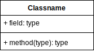

# 第1回目 UML

2021年04月06日（火曜日）
[参考資料](http://edu.net.c.dendai.ac.jp/ad2/2021/1)

## はじめに

- 使用言語: Java 1.8, (JavaScript, Python)
- 上記の選定理由: 静的型付け言語のため。TypeScript使えば…？
- 使用環境: Eclipse（他の環境でも良い）
- 上記をオススメする理由: javaのインストールが面倒くさい

### 2019年の事件

WWC: (world wide consortium) Web規格団体。**XML**のルーツ。

XML → HTML

ところが…

2019年5月にhtmlの規格団体がw3cからwhatwgに譲渡。

## UML

フローチャートを滅ぼす存在。統一モデリング言語。

|         分類         |         名称         | 役割                                           |
| :------------------: | :------------------: | :--------------------------------------------- |
|        構造図        |     **クラス図**     | クラスの特性位や関係                           |
|        構造図        |  **オブジェクト図**  | 実際のインスタンスの構造                       |
|        構造図        |     パッケージ図     | プログラムのコンパイルにおける依存関係など     |
|        構造図        |        配置図        | システムにおけるオブジェクトなどの配置         |
|        構造図        |   コンポーネント図   | システムの機能毎の分類と関連                   |
|        構造図        |  コンポジット構造図  | クラスの内部構造の段階的表現                   |
|      振る舞い図      |  **ユースケース図**  | ユーザーとシステムの関わり合い                 |
|      振る舞い図      |   **状態マシン図**   | システムの振る舞いの記述                       |
|      振る舞い図      | **アクティビティ図** | フローチャートのような並列的な手続きの流れ     |
| 振る舞い図、相互作用 |   **シーケンス図**   | 各オブジェクト間でのメッセージのやり取りの流れ |

### オブジェクト図

```java
class A {
  public void f(){
    B b = new B();
  }
}
class B {
  public B(){}
}
class Rei {
  public static void main(String[] arg){
    A a = new A();
    a.f();  // この図
  }
}
```



### クラス図

クラスのすべての動きを集約した図。

- クラス名
- 変数名（`-`: private、`+`: public）
- メソッド名



### ユースケース図

考えられるさまざまな仕事をユースケースとして記述。

### 状態マシン図

オートマトンと似ている。特定の状態において、外部の入力により次にどの状態になるのかを矢印で記述する。

Webアプリケーションを作成する際に重要となる。

### アクティビティ図

フローチャート。名前が変わっただけ。

### 相互作用図、シーケンス図

オブジェクトの寿命を表す。

### UML作画ツール

#### ドローツール

draw.ioや[dia](http://dia-installer.de/)など

#### 専用ソフト

略
