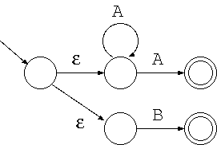

# 第2回目 正規表現、非決定性オートマトン

2021年04月13日（火曜日）
[参考資料](http://edu.net.c.dendai.ac.jp/ad2/2021/2)

## 電卓には2種類ある

```text
1+2*3
```

- `7`
- `9`

## オートマトン

is何:

- 一般用語: からくり人形


## 正規文法

コンピュータで文字列を解釈する。

```text
- アルファベット Σ
  使用する記号の集合
- Σ∗
  空列を含む生成可能な記号列すべての集合
- 文法 G
  記号列を生成するルール
- 言語 L(G)
  G にしたがって生成される記号列すべての集合
```

例:

```text
Σ = {0, 1}
Σ* = {ε, 0, 1, 00, 01, 10, 11, 000, ...}
G = "1で終わらないもの"
↓
L(G) = {ε, 0, 10, 000, 010, ...}
```

### 正規表現

1. εは正規表現。
2. アルファベット1文字は正規表現。
3. RとSが正規表現なら、`R|S, RS, {R}`は正規表現。（`{R}`はRの0回以上の繰り返し）

例:

```text
G_1 = {a}
      L(G_1) = {ε, a, aa, aaa, ...}

G_2 = a|b|c
      L(G_2) = {a, b, c}

G_3 = (1|2|3|4|5|6|7|8|9){(1|2|3|4|5|6|7|8|9)}
      L(G_3) = 自然数
```

#### コンピュータ上の表現

1. 文字は正規表現
2. 正規表現の連結は正規表現
3. `?`は任意の一文字、`*`は任意の文字列を表します。

#### Javaでの正規表現

`java.util.regex`

https://github.com/yuto51942/socket-programming-project/blob/c6b8ddbd386d65f3e9d1d63b68f3075303f70de1/server/Server.java#L18

## 非決定性オートマトン

- 正規表現でかけるものはオートマトンで書ける。
- オートマトンで書けるものは正規表現で書ける。

1. 開始ノードというノードが1つ指定される
2. 終了ノードが1つ以上指定される
3. 各辺には文字が1つ以上割り振られている。

- 種類
  - 各ノードから出る辺に割り当てられている文字がすべて異なるオートマトン: **決定性オートマトン**
  - ε（空文字）が含まれるオートマトン: **非決定性オートマトン**


