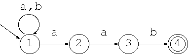
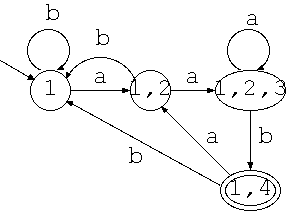

# 第3回目 決定性オートマトン

2021年04月13日（火曜日）
[参考資料](http://edu.net.c.dendai.ac.jp/ad2/2021/3)

## 決定性オートマトン

次の状態の遷移が曖昧ではない。

## 決定性オートマトンと非決定性オートマトンの等価性

- 非決定性オートマトン → 決定性オートマトン

- `.*aab`を受理する非決定性オートマトン

  

↓

- 決定性オートマトン

  

## 正規表現の入力

- 非決定性オートマトンの状態数をmとした場合、決定性オートマトンではO(2^m)個のリスト間の関係を調べなければならない。
- 非決定性で、複数箇所へ**行ったこと**にすることで探査する。
