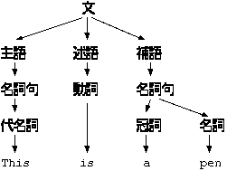

# 第4回目 文脈自由文法と構文解析木

2021年04月20日（火曜日）
[参考資料](http://edu.net.c.dendai.ac.jp/ad2/2021/4)

## 文脈自由文法

### 文法とルール

- S+V
  - 例: I ski. It rains. I have returned. This class has begun.
- S+V+C
  - 例: This is a pen. I am a student. You look tired.
- S+V+O
  - 例: I love you. I am studying programming.
- S+V+O+O
  - 例: I teach you theories of programming.
- S+V+O+C
  - 例: I find you asleep.

### バッカス・ナウア記法

4つ組、$G=(V_N, V_T, P, S)$で表す。

- $V_N$: 品詞の集合
- $V_T$: 単語
- $P$: 導出規則
- $S\in V_N$: 開始記号

1. 開始記号を左辺に含むルールを1つ選ぶ
2. 開始記号をそのルールの右辺に置き換える
3. 置き換えらものの中から非終端記号を1つ選ぶ
4. その非終端記号を左辺に含むルールを1つ選ぶ
5. その非終端記号を右辺に置き換える
6. すべてが終端記号なら終了、そうでない場合は3に戻る

- 左辺や右辺を`::=`や`→`という記号で結ぶ。
- Pの定義
  - 文→主語、述語、補語
  - 述語→名詞句
  - ...

## 構文解析木

日本語など→あいまい

### Σプロジェクト

- 1985年に始まった日本政府の国家プロジェクト
- 失敗
- [wikipedia](https://ja.wikipedia.org/wiki/%CE%A3%E3%83%97%E3%83%AD%E3%82%B8%E3%82%A7%E3%82%AF%E3%83%88)

### 第五世代コンピュータ

- 非ノイマン型コンピュータを作るプロジェクト
- 人工知能第二次ブーム
- 失敗
- Prolog(プログラミング言語)

### 素朴な解析法

- $和→和+数$
- $和→数$

### LL(1)文法

- $和→数和'$
- $和'→+数和'|\epsilon$
